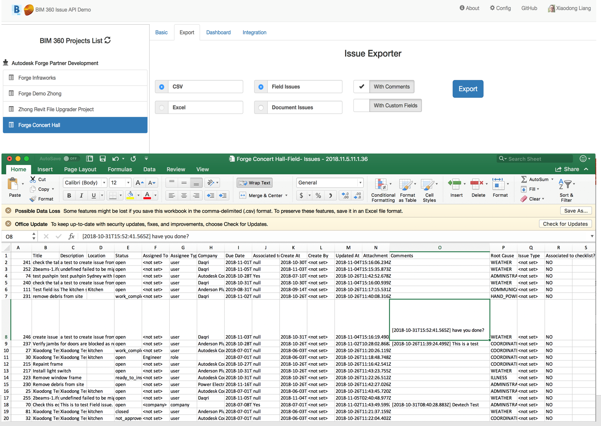
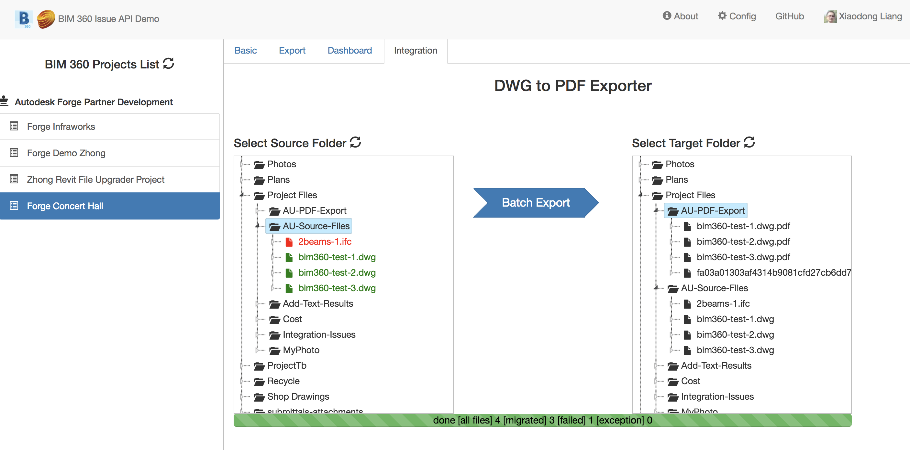

# bim360-node.js-issues.api
This repository demonstrates BIM 360 Field Issues API by a couple of scenarios: basic usage, export customized CSV, issues statistic and export DWG to PDF (create issue for failure job)

[](https://nodejs.org)
[](https://www.npmjs.com/)
[](https://code.visualstudio.com)
[](http://developer.autodesk.com/)
[](http://developer.autodesk.com/)
[](http://developer.autodesk.com/)
[](http://developer.autodesk.com/)
[](http://developer.autodesk.com/)
[](http://opensource.org/licenses/MIT)
[](http://developer.autodesk.com/)


```diff
-As of this writing, you see two separate set of APIs for Document and Field Issues. 
-They are v1. Soon, they are going to merge. 
-After that happens, you can use similar endpoints like Field Issues: And they will be unified Issues. 
-In this sample, most codes are demoed with Field Issues endpoints
```

## Description
This repository demonstrates BIM 360 Field Issues API by a couple of scenarios: 
1. basic usage
2. export issues list to customized CSV with comments list or with custom fields
3. dashboard of issues statistics
4. export DWG to PDF (create issue for failure job)

## Thumbnail

  


## Live version
http://au2018-bim360-issue.herokuapp.com/

# Setup
## Prerequisites
1. **BIM 360 Account**: must be Account Admin to add the app integration. [Learn about provisioning](https://forge.autodesk.com/blog/bim-360-docs-provisioning-forge-apps).
2. **Forge Account**: Learn how to create a Forge Account, activate subscription and create an app at [this tutorial](http://learnforge.autodesk.io/#/account/). 
3. **Visual Studio**: Either Community (Windows) or Code (Windows, MacOS).
4. **Node.js**: basic knowledge with **Node.js**.
5. **JavaScript** basic knowledge with **jQuery**

## Running locally
Clone this project or download it. It's recommended to install [GitHub desktop](https://desktop.github.com/). To clone it via command line, use the following (**Terminal** on MacOSX/Linux, **Git Shell** on Windows):

    git clone https://github.com/xiaodongliang/bim360-node.js-issues.api

**Visual Sutdio Code** (Windows, MacOS):

Open the folder, at the bottom-right, select **Yes** and **Restore**. This restores the packages (e.g. Autodesk.Forge) and creates the launch.json file. See *Tips & Tricks* for .NET Core on MacOS.

At the `.vscode\launch.json`, find the env vars and add your Forge Client ID, Secret and callback URL. Also define the `ASPNETCORE_URLS` variable. The end result should be as shown below:

```json
"env": { 
    "FORGE_CLIENT_ID": "your id here",
    "FORGE_CLIENT_SECRET": "your secret here",
    "FORGE_CALLBACK_URL": "http://localhost:3000/api/forge/callback/oauth",
},
```

## Deployment

To deploy this application to Heroku, the **Callback URL** for Forge must use your `.herokuapp.com` address. After clicking on the button below, at the Heroku Create New App page, set your Client ID, Secret and Callback URL for Forge.

[](https://heroku.com/deploy?template=https://github.com/xiaodongliang/bim360-node.js-issues.api)

Watch [this video](https://www.youtube.com/watch?v=Oqa9O20Gj0c) on how deploy samples to Heroku.

## Demonstrations

### Demo 1: Basic Usage of Issue API
1. Select one project in the left panel tree.
2. select one due date on the top of the issue tree. The issues at the specific due date will be listed.
3. expand the attributes to check the values
4. click pushpin attributes if it is not null. The corresponding model will be loaded and the issue pushpin will be added by Pushpin Extension
5. fill in issue title and due date, click [create issue], one new issue will be created. 
6. select one issue in the issue tree, fill in comment body, and click [create comments], one new comment will be attached to the issue
7. select one issue in the issue tree, select one local photo, click []

   

### Demo 2: Export Customized CSV
1. Select one project in the left panel tree.
2. Check [Field Issue] or [Document Issue], tick [With Comments] or [With Custom Fields] 
3. click [Export]. an CSV will be generated 
note： currently, the sample has not implemeted Excel export. The button is for placing hold.

   


### Demo 3: Dashboards of Issues Statistic

1. Select one project in the left panel tree.
2. The dashboard will be refreshed. Or  click [Refesh] button to ask for refreshing
3. select [due date] of [Number of Issues due at this week] will regenerate the view with those issues will due at specific week
   


### Demo 4: Export DWG to PDF (create issue with failure job)
1. Select one project in the left panel tree.
2. select source files folder in [Select Source Folder]
3. select target files folder in [Select Target Folder]
3. click [Batch Export]. All files will be exported by PDF action of AutoCAD Design Automation. IF any of them failed with the action, a log file will be uploaded to the target folder, and a Field issue will be created with the log as attachment
note： Plan folder has special behavior with PDF files. So currently, please use other folders to test.
   
 

# Further Reading
- [BIM 360 API](https://developer.autodesk.com/en/docs/bim360/v1/overview/) and [App Provisioning](https://forge.autodesk.com/blog/bim-360-docs-provisioning-forge-apps)
- [Data Management API](https://developer.autodesk.com/en/docs/data/v2/overview/)
- [Viewer](https://developer.autodesk.com/en/docs/viewer/v6)

Tutorials:

- [View BIM 360 Models](http://learnforge.autodesk.io/#/tutorials/viewhubmodels)
- [Retrieve Issues](https://developer.autodesk.com/en/docs/bim360/v1/tutorials/retrieve-issues)

Blogs:

- [Forge Blog](https://forge.autodesk.com/categories/bim-360-api)
- [Field of View](https://fieldofviewblog.wordpress.com/), a BIM focused blog

### Tips & Tricks


### Troubleshooting

1. **Cannot see my BIM 360 projects**: Make sure to provision the Forge App Client ID within the BIM 360 Account, [learn more here](https://forge.autodesk.com/blog/bim-360-docs-provisioning-forge-apps). This requires the Account Admin permission.
 
## License

This sample is licensed under the terms of the [MIT License](http://opensource.org/licenses/MIT). Please see the [LICENSE](LICENSE) file for full details.

## Written by

Xiaodong Liang [@coldwood](https://twitter.com/coldwood), [Forge Partner Development](http://forge.autodesk.com)
